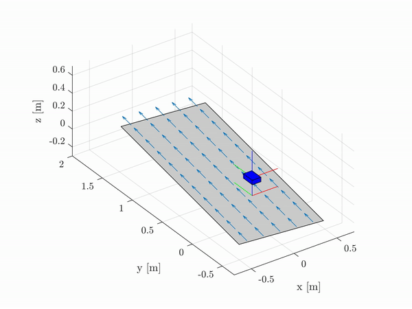
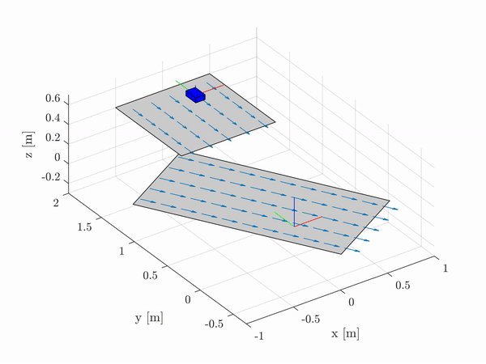

<div align="center">
<h1 align="center">
Box-Simulator
</h1>
</div>
<div align="center">
<h3>
<a href="https://research.tue.nl/en/persons/maarten-jongeneel">Maarten Jongeneel</a>
<br>
<br>
Simple robotics simulator for objects that experience impact and friction
<br>
<br>
This simulator was developed as part of my <a href="https://research.tue.nl/en/studentTheses/model-based-visual-object-tracking-with-collision-models">MSc Thesis</a>
<br>
<br>
</h3>
</div>

If you are using this simulator, please refer to it as
```bibtex
@MastersThesis{2020_JongeneelModelBasedVisual,
    author  = {Maarten Johannes Jongeneel},
    title   = {{Model-Based Visual Object Tracking with Collision Models}},
    school  = {Eindhoven University of Technology, Faculty of Mechanical Engineering,
                Dynamics \& Control Section},
    address = {the Netherlands},
    year    = {2020},
    month   = {March}
    }
```
# Requirements
 - MATLAB 2020a or later. 

# Introduction

This project contains the code I used during my MSc thesis for simulating a box impacting a surface. The code is numerical integration of a nonsmooth dynamical model with impacts and friction, using an augmented Lagrangian approach from [1]. By running the main script `main.m`, you can simulate a box being tossed on a contact surface.
The simulator itself is fully contained in the function `BoxSimulator.m`, which contains all the necessary functions to run. All settings can be set within the main scripts listed above and the comments provided there should suffice to understand the script. The underlying theory is further explained in my thesis, which can be found [here](https://research.tue.nl/en/studentTheses/model-based-visual-object-tracking-with-collision-models).


Table of content
================
- [Overview](#overview)
- [Installation](#installation)
- [Usage of the scripts](#usage-of-the-scripts)
- [Contact](#contact)

# Overview
In current form, the simulator allows you to simulate a single box being tossed on one or multiple surfaces, which can each have a certain speed (to simulate e.g., a conveyor). This contact surface can have a certain position and orientation w.r.t. a world frame, and a certain velocity in any direction. The box can have a certain initial position, orientation, linear and angular velocity, and you can set the coefficients of friction, normal restitution, and tangential restitution. The video below shows two examples of simulations results, for which the scenes can be found in the [scenes](/scenes) folder. 
<div align="center">
    <div style = "display: flex; align="center">
         
        
    </div>
    <p>Figure 1: Two videos showing examples of simulation results. The two videos correspond to the two scenes described in the scenes folder.</p>
</div>

# Installation
The code of this repository is all written in MATLAB and can directly be cloned from this repository. To clone this repo, open a command window and type:
```cmd
git clone https://github.com/MaartenJongeneel/box-simulator.git
```

# Usage of the scripts
The simulator itself is the function `BoxSimulator.m`, which is a stand alone function. This function is called by the main script `main.m`, which contains all settings for the simulation and should be run to initialize the simulation and obtain the results. Below, we give some further details on the settings.<br>

## General settings
The general settings as shown below allow you to decide if you want to save the resulting trajectory (4x4 transformation matrices), if you want to plot the resulting trajectory (as shown in the video above), and if you want to save this trajectory to an `.avi` video.
```matlab
%% General settings
dosave             = false;         %Save the trajectory (AH_B) to a .mat file
doPlot             = true;          %Show the trajectory of the box
MakeVideo          = false;         %Save the simulation result to video
```

## Running scenes
In the [scenes](/scenes) folder, some examples of scenes are provided. These scenes contain the information about the box and the surfaces that define the scene. In Matlab, these scenes are loaded via the following lines of code:
```matlab
%% Read the scene that you want to run
SingleConveyor;
% DoubleConveyor;
```
where the variable for `SingleConveyor` or `DoubleConveyor` should be commented/uncommented in case a different scene should be run. 
### Defining the Box
In the scene file, say, `DoubleConveyor` you define the box object following this structure:
```matlab
%% Box release position
box.release.orientation = eye(3);    %Release orientation of the box            [deg]
box.release.position = [0 1.5 0.6];  %Release position of the box               [m]
box.release.linVel = [0 0 0];        %Release linear velocity (expressed in B)  [m/s]
box.release.angVel = [3 1 0];        %Release angular velocity (expressed in B) [rad/s]
box.parameters.eN = 0.4;             %Normal coefficient of restitution         [-]
box.parameters.eT = 0.0;             %Tangential coefficient of restitution     [-]s
box.parameters.mu = 0.5;             %Coefficient of friction                   [-]
box.mass = 1;                        %Box mass                                  [kg]
box.dimensions = [0.1 0.15 0.05];    %Box dimensions                            [m]
box.inertia_tensor = [eye(3), zeros(3,3); zeros(3,3), [0.0021, 0, 0; 0, 0.001, 0; 0, 0, 0.0027]];  %Box inertia tensor
box.discretization = 4;              %Box discretization of the contact points  [-]
```
You can set here the mass, dimensions, and the 6x6 generalized inertia tensor. Furthermore, you need to specify the release position, orientation (3x3 rotation matrix), and linear and angular velocity. The parameters `mu`, `eN`, and `eT` define the coefficient of friction, normal restitution, and tangential restitution, respectively. Finally, the `discretization` parameter defines in how many contact points you want to discretize the surfaces. For the values given above, the image below show the resulting box model, with the contact points indicated in blue (note that the `discretization` of `4` in this case leads to 4 contact points in each dimension on the surface of the box.).
<div align="center">
    <div style = "display: flex; align="center">
         
    </div>
    <p>Figure 2: Geometric model of the box with the contact points indicated in blue.</p>
</div>

### Defining contact surfaces
The position and orientation of the contact surface are defined by the 4x4 transformation matrix, defining its position and orientation w.r.t. the world frame. The speed of the conveyor is defined in it's own frame in `m/s` (typically you would have this only in x- and y- direction, but sure, you can also put a z-velocity (out of plane).). The dimensions of the contact surface are in meters. In the yaml file that defines the scene, you can set these parameters. The example below shows how:

```matlab
%% Environment
surface{1}.dim = [1 1];              %Dimension of the surface                  [m]
surface{1}.speed = [0; -1; 0];       %Speed of the surface                      [m/s]
surface{1}.transform = [eye(3), [0; 1.5; 0.4]; zeros(1,3), 1]; %4x4 Transformation matrix 

surface{2}.dim = [1 2];              %Dimension of the surface                  [m]
surface{2}.speed = [0; -1; 0];       %Speed of the surface                      [m/s]
surface{2}.transform = [Rz(30), [0; 0.5; 0]; zeros(1,3), 1]; %4x4 Transformation matrix 
```

## Simulation settings
In the settings below, we define the runtime of the simulation, the stepsize (`c.dt`), and the speed with which the simulation result is played back (`step`). The values for (`c.a`) and (`c.tol`) refer to the settings of the fixed-point iteration that is used to solve the contact problem, and define the auxilary parameter and the error tolerance of convergence, respectively.
```matlab
%% Parameters for input
c.a                  = 0.001;         %Prox point auxilary parameter             [-]
c.tol                = 1e-7;          %Error tol for fixed-point                 [-]
c.m                  = 1;             %Mass of the box                           [kg]  
c.endtime            = 1.5;           %Runtime of the simulation                 [s]
c.dt                 = 1/1000;        %Timestep at which the simulator runs      [s]
step                 = 1/c.dt/100;    %Number of discrete points we skip per shown frame
```

# Contact
In case you have questions or if you encountered an error, please contact us through the "Issues" functionality on GIT, or send an email to [m.j.jongeneel@tue.nl](mailto:m.j.jongeneel@tue.nl). 
