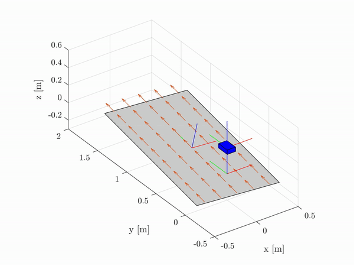
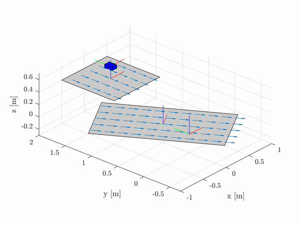
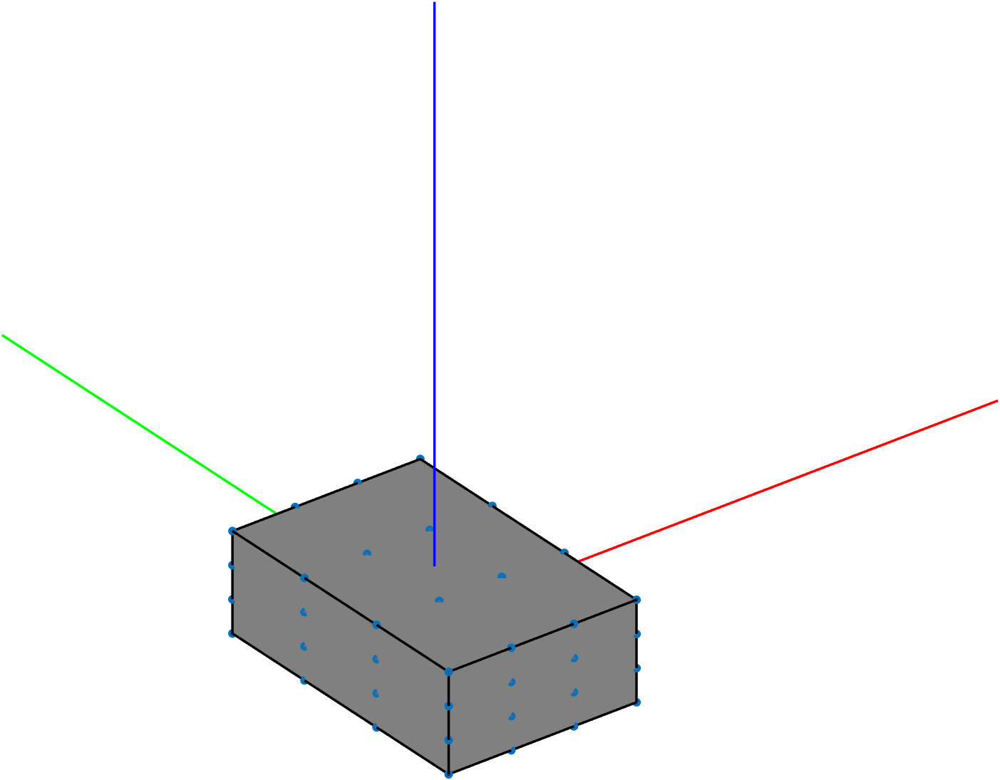

<div align="center">
<h1 align="center">
Box-Simulator
</h1>
</div>
<div align="center">
<h3>
<a href="https://research.tue.nl/en/persons/maarten-jongeneel">Maarten Jongeneel</a>
<br>
<br>
Simple robotics simulator for objects that experience impact and friction
<br>
<br>
This simulator was developed as part of my <a href="https://research.tue.nl/en/studentTheses/model-based-visual-object-tracking-with-collision-models">MSc Thesis</a>
<br>
<br>
</h3>
</div>

If you are using this simulator, please refer to it as
```bibtex
@MastersThesis{2020_JongeneelModelBasedVisual,
    author  = {Maarten Johannes Jongeneel},
    title   = {{Model-Based Visual Object Tracking with Collision Models}},
    school  = {Eindhoven University of Technology, Faculty of Mechanical Engineering,
                Dynamics \& Control Section},
    address = {the Netherlands},
    year    = {2020},
    month   = {March}
    }
```
# Requirements
 - MATLAB 2020a or later. 

# Introduction

This project contains the code I used during my MSc thesis for simulating a box impacting a surface. The code is numerical integration of a nonsmooth dynamical model with impacts and friction. By running the main script `main.m`, you can simulate a box being tossed on a contact surface.
It uses an augmented Lagrangian approach from [1]. Furthermore the folder **Functions** contains all the necessary functions to run. All settings can be set within the main scripts listed above and the comments provided there should suffice to understand the script. The underlying theory is further explained in my thesis, which can be found [here](https://research.tue.nl/en/studentTheses/model-based-visual-object-tracking-with-collision-models).


Table of content
================
- [Overview](#overview)
- [Installation](#installation)
- [Usage of the scripts](#usage-of-the-scripts)
- [Contact](#contact)

# Overview
In current form, the simulator allows you simulate a single box being tossed on one or multiple surfaces, which can each have a certain speed (to simulate e.g., a conveyor). This contact surface can have a certain position and orientation w.r.t. a world frame, and a certain velocity in any direction. The box can have a certain initial position, orientation, linear and angular velocity, and you can set the coefficients of friction, normal restitution, and tangential restitution. The video below shows an example of a simulation result. 
<div align="center">
    <div style = "display: flex; align="center">
         
        
    </div>
    <p>Figure 1: Video of an example simulation.</p>
</div>

# Installation
The code of this repository is all written in MATLAB and can directly be pulled from this repository. 

# Usage of the scripts
The simulator itself is the function `BoxSimulator.m`, which is a stand alone function. This function is called by the main script `main.m`, which contains all settings for the simulation and should be run to initialize the simulation and obtain the results. Below, we give some further details on the settings.<br>

## General settings
The general settings as shown below allow you to decide if you want to save the resulting trajectory (4x4 transformation matrices), if you want to plot the resulting trajectory (as shown in the video above), and if you want to save this trajectory to an `.avi` video.
```matlab
%% General settings
dosave             = false;         %Save the trajectory (AH_B) to a .mat file
doPlot             = true;          %Show the trajectory of the box
MakeVideo          = false;         %Save the simulation result to video
```

In the settings below, we define the properties of the box (length, width, height, restitution, friction), and the initial position, orientation, linear and angular velocity of the box. Furthermore, you can set the runtime of the simulation, the stepsize (`c.dt`), and the speed with which the simulation result is played back (`step`). The values for (`c.a`) and (`c.tol`) refer to the settings of the fixed-point iteration that is used to solve the contact problem, and define the auxilary parameter and the error tolerance of convergence, respectively.
```matlab
%% Parameters for input
x.releaseOrientation = Rx(0);         %Release orientation of the box            [deg]
x.releasePosition    = [0; 0; 0.3];   %Release position of the box               [m]
x.releaseLinVel      = [0; 0; 0];     %Release linear velocity (expressed in B)  [m/s]
x.releaseAngVel      = [3; 1; 0];     %Release angular velocity (expressed in B) [rad/s]
c.eN                 = 0.4;           %Normal coefficient of restitution         [-]
c.eT                 = 0.0;           %Tangential coefficient of restitution     [-]
c.mu                 = 0.6;           %Coefficient of friction                   [-]
l                    = 0.1;           %Length of the box                         [m]
w                    = 0.15;          %Width of the box                          [m]
h                    = 0.05;          %Height of the box                         [m]
c.a                  = 0.001;         %Prox point auxilary parameter             [-]
c.tol                = 1e-7;          %Error tol for fixed-point                 [-]
c.m                  = 1;             %Mass of the box                           [kg]  
c.endtime            = 1.5;           %Runtime of the simulation                 [s]
c.dt                 = 1/1000;        %Timestep at which the simulator runs      [s]
step                 = 1/c.dt/100;    %Number of discrete points we skip per shown frame
```

## Box geometric model
The simulation is assuming an object with uniform mass distribution and computes the inertia tensor according to 
```matlab
%Mass matrix of the box
Ml = c.m*eye(3);

%Inertia matrix of the box
I  = [(c.m/12)*(w^2+h^2),                 0,                  0;
                     0,  (c.m/12)*(l^2+h^2),                  0;
                     0,                 0,   (c.m/12)*(l^2+w^2);];
%Inertia tensor
box.B_M_B = [Ml zeros(3,3); zeros(3,3) I];
```
based on the dimensions of the box you specified. Obviously, this can be changed in case a different mass distribution is needed.<br>
The geometry of the box is defined by a set of contact points, that can be the vertices of the box only, or further discretized along the edges and surfaces of the box. The code below (as part of `main.m`) computes these contact points based on a certain discretization chosen:
```matlab
%Discretization of the box vertices
Ndisc=4; %Define the discretization 
[X,Y,Z]=meshgrid(linspace(-l/2,l/2,Ndisc),linspace(-w/2,w/2,Ndisc),linspace(-h/2,h/2,Ndisc));
pbool = (abs(X(:))==l/2) | (abs(Y(:))==w/2) | (abs(Z(:))==h/2);
box.vertices= [X(pbool)';Y(pbool)';Z(pbool)'];
```
The image below show the resulting box model, with the contact points indicated in blue.
<div align="center">
    <div style = "display: flex; align="center">
         
    </div>
    <p>Figure 2: Geometric model of the box.</p>
</div>

## Defining contact surfaces
Contact surfaces are simply defined by a position, orientation, size, and speed. In the code below, we show how 2 surfaces can be stored in a `surface` struct:
```matlab
surface{1}.transform = [Rz(30) [0; 0.5; 0]; zeros(1,3),1];
surface{1}.speed = [0; 1; 0];
surface{1}.dim = [1 2];
surface{2}.transform = [Rz(0) [0; 1.5; 0.4]; zeros(1,3),1];
surface{2}.speed = [0;-1;0];
surface{2}.dim = [1 1];
```
The position and orientation of the contact surface are defined by the 4x4 transformation matrix, defining its position and orientation w.r.t. the world frame. The speed of the conveyor is defined in it's own frame in `m/s` (typically you would have this only in x- and y- direction, but sure, you can also put a z-velocity (out of plane).). The dimensions of the contact surface are in meters. The functions `Rx(ang)`, `Ry(ang)`, and `Rz(ang)` provide a rotation matrix for pure rotations around the `x`-,`y`-, and `z`-axis, respectively, for a rotation of `ang` degrees.  

# Contact
In case you have questions or if you encountered an error, please contact us through the "Issues" functionality on GIT, or send an email to [m.j.jongeneel@tue.nl](mailto:m.j.jongeneel@tue.nl). 
